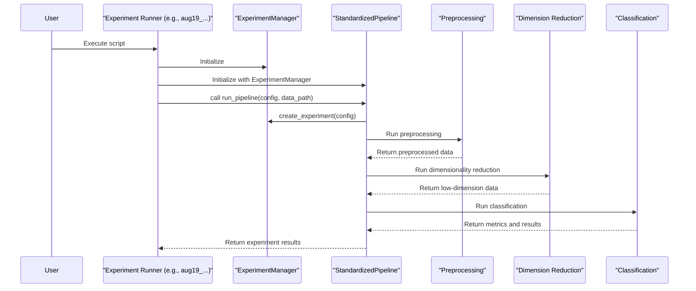

# Project Design: sc_classification

This document provides a high-level overview of the `sc_classification` project's architecture and workflow. Its purpose is to help developers and researchers understand how the different components of the pipeline interact.

## Core Workflow

The core of this project is a standardized pipeline for single-cell data analysis, focusing on MRD (Minimal Residual Disease) classification. The pipeline is designed to be modular and configurable, allowing for different methods of preprocessing, dimensionality reduction, and classification to be tested and compared systematically.

The typical workflow consists of three main stages:

1.  **Preprocessing:** Raw single-cell data (in `AnnData` format) is loaded and prepared for analysis. This includes filtering cells and genes based on various criteria, and standardizing the data. The gene selection can be customized with different strategies, such as selecting Highly Variable Genes (HVGs) or using supervised methods based on differential expression.

2.  **Dimensionality Reduction:** The high-dimensional gene expression data is projected into a lower-dimensional space. This step helps to reduce noise and capture the most important biological signals. The pipeline currently supports Factor Analysis (FA) and Non-negative Matrix Factorization (NMF).

3.  **Classification:** A classification model is trained on the low-dimensional representation of the data to distinguish between cell types (e.g., 'cancer' vs. 'normal'). The primary classifier used is Logistic Regression with LASSO (L1) regularization, which also performs feature selection.

Experiments are managed by the `ExperimentManager` class, which handles the configuration and saves all results, models, and metadata to a structured directory, ensuring reproducibility.

## System Architecture Diagram

The following diagram illustrates the sequence of operations when running an experiment:

