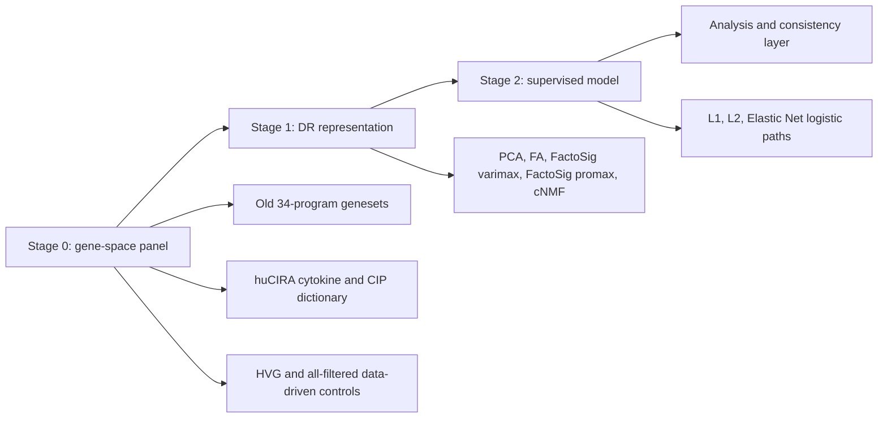

# Stage 0 Gene-Set Value-Added Workflow

Status: planning. This document defines the next MRD and MRD+Relapse workflow before implementing new runners.

## Motivation

The current old-geneset pruning analysis is mainly top-down: start from the full 34-program panel, then measure what is lost when a geneset or biology group is removed. The next pass should add a bottom-up view: start from one geneset, one group, or one biological dictionary branch and measure the value added by that gene space under matched downstream modeling.

The scientific question is not only whether a smaller panel preserves structure. The primary question is whether a stage-0 gene space improves malignant-vs-healthy classification, with structure preservation kept as a diagnostic because cell type and pseudotime annotations may be biased toward PCA/kNN-style upstream workflows.

## Modeling Goals

- Primary: MRD malignant vs healthy classification.
- Secondary: MRD+Relapse four-class modeling with `MRD_cancer`, `MRD_normal`, `Relapse_cancer`, and `Relapse_normal`.
- Supporting binary tasks for MRD+Relapse: cancer vs normal, time within cancer, and time within normal.

## Framework

## Stage 0: Gene-Space Panels

Use a unified panel manifest for every branch. Each panel row should include `panel_id`, `panel_family`, `source_dictionary`, `genesets_included`, `n_gene_sets`, `n_genes`, coverage in the input AnnData, overlap with HVG, overlap with the full 34-program panel, and intended modeling goal.

Old 34-program branch:

- Keep existing controls: `full_34`, `core_only`, strict leave-one-geneset-out, strict group dropout, and redundancy-pruned panels.
- Add bottom-up panels: one geneset alone, one biology group alone, and optional cumulative unions built from individually ranked panels.
- Reuse `scripts/knowledge_driven_embedding/older_geneset/manifest.tsv` and `scripts/knowledge_driven_embedding/older_geneset/genesets_v1.gmt`.

huCIRA branch:

- Treat huCIRA as a separate biological prior, not as a mixed extension of the old 34-program panel in the first pass.
- Export cytokine-response and CIP programs to the same panel manifest schema.
- Compare huCIRA panels to old-geneset panels only after both have matched HVG controls.

Data-driven controls:

- Treat HVG as the explicit stage-0 data-driven comparator.
- Include size-matched HVG panels for each knowledge-driven panel.
- Include fixed HVG anchors such as 500, 1000, 3000, and 10000 genes.
- Include `all_filtered` as the broad data-driven reference used by the April 2026 old-geneset run.
- Optionally include random size-matched panels binned by expression/coverage as negative controls.

## Stage 1: Representation Learning

Reuse the previous DR suite wherever feasible:

- `pca`
- `fa`
- `factosig` / varimax
- `factosig_promax`
- `cnmf`

Run a K grid that respects panel size:

- Small single-set panels: start with `K in {5, 10, 20, 40}` and cap by effective rank.
- Full or group panels: keep `K in {20, 40, 60}` for continuity with the prior runs.
- Always write requested `K`, effective `K`, seed, method, panel ID, and feature count.

Use one seed for broad screening, then rerun controls and shortlisted panels with repeated seeds.

## Stage 2: Supervised Classification

For MRD malignant vs healthy:

- Reuse the Plan 1.C logistic path: L1, L2, and elastic net.
- Keep `alpha=logspace(-4,5,20)` and elastic-net `l1_ratio in {0.1,0.5,0.9}`.
- Evaluate pooled-cell repeated CV with per-patient out-of-fold metrics and per-patient repeated CV.

For MRD+Relapse:

- Plug stage-0 panels into the patient-level relapse/MRD preprocessing path.
- Preserve patient-local CV to avoid leakage across the paired-timepoint design.
- Compare against patient-local HVG built by the current relapse/MRD preprocessing.

## HVG-As-Stage-0 Comparison

The fair comparison is not "single geneset vs HVG 10k" as the primary claim. The main comparison should be budget-matched:

- knowledge panel vs size-matched HVG
- knowledge panel vs fixed HVG anchor
- knowledge panel vs `full_34`
- old-geneset branch vs huCIRA branch, after both are compared to matched HVG

Report deltas as separate columns:

- `delta_vs_hvg_size_matched`
- `delta_vs_hvg_anchor`
- `delta_vs_full_34`

Only compare rows that match cohort, label definition, stage-1 method, effective `K`, seed policy, stage-2 classifier grid, and split policy.

## Analysis Layer

Build a unified scorecard with one row per complete run key:

- modeling goal
- stage-0 panel and panel family
- DR method and K
- seed
- stage-2 mode
- penalty, alpha, and l1 ratio
- split policy
- status and skip reason

Use separate score blocks:

- Malignancy block: AUROC, AUPRC, balanced accuracy, malignant recall, malignant precision, and per-patient spread.
- Parsimony block: number of genes, number of genesets, overlap with HVG/full panel, and nonzero classifier coefficients.
- Structure block: cell-type kNN purity, pseudotime smoothness, silhouette, and neighbor diagnostics.

Selection should be malignancy-first. Structure metrics should flag suspicious geometry but should not dominate the next panel choice.

## Consistency Checks

Before biological interpretation, check:

- non-monotonic K behavior within each panel and method
- seed variance for shortlisted panels
- fold variance and patient-level heterogeneity
- whether effective K is capped by panel size or cell count
- whether PCA-specific gains are concentrated in structure metrics rather than malignant classification
- whether a knowledge-driven panel beats size-matched HVG, not only a smaller or weaker baseline

## Initial Implementation Order

1. Build the panel manifest layer for old genesets, HVG controls, and huCIRA controls.
2. Add bottom-up panel generation to the existing old-geneset pruning runner or a new stage-0 runner.
3. Generalize stage-1 DR output layout so all panels can feed the same stage-2 benchmark.
4. Generalize the Plan 1.C supervised benchmark so it reads arbitrary stage-0/stage-1 artifacts.
5. Add the unified scorecard and malignancy-first leaderboard.
6. Extend the same stage-0 idea to relapse/MRD patient-local modeling.
